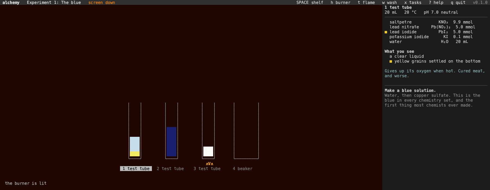

# alchemy



**A chemistry bench in the terminal. Written in Rust.**

   

Four glasses, a shelf of about seventy reagents and a burner. Pour
things together and watch what happens: the colour of the liquid, what
settles out of it, what bubbles away, how warm the glass gets and how
acid it is.

Nothing is canned. Every reaction runs at a speed set by how crowded its
reactants are, so a thin solution takes its time and a dry powder goes
at once. The picture on screen is drawn from whatever is left in the
glass: in real pixels in glass, or any terminal that shows images, and
in character cells elsewhere.

Part of the [Fe₂O₃ suite](https://isene.github.io/fe2o3/). Built on
[crust](https://github.com/isene/crust).



## What you can see

- **Salts made in front of you.** Acid and base cancel out, then boil
  the water off and the salt is sitting in the bottom of the tube.
- **Iodine on starch.** Blue black at once, and gone again the moment
  hypo eats the iodine.
- **The iodine clock.** Clear, clear, clear, then blue all at once. And
  the other one, which swings blue and clear and blue again until the
  fuel runs out.
- **Precipitates.** A white curd names a chloride, a heavy white cloud
  names a sulfate, and lead iodide falls as golden rain.
- **A silver tree** growing on a strip of copper.
- **Flame colours.** Dip the wire and every metal shows its own: sodium
  yellow, potassium lilac, copper blue green.
- **The mixtures that go off**, and what they cost when nothing stands
  between you and the glass.

## The experiments

1. **The blue**: the first thing most chemists ever made.
2. **Iodine on starch**: a colour so strong a trace of it shows.
3. **Make table salt**: from an acid and a base, then boil it dry.
4. **Find the chloride**: the white curd that names it.
5. **Golden rain**: two clear solutions and bright yellow flakes.
6. **Chalk out of thin air**: turn limewater milky with your own gas.
7. **A silver tree**: copper hands over its electrons.
8. **The iodine clock**: the wait, and then the snap.
9. **The clock that keeps going**: a loop that eats its own product.
10. **Flame colours**: find the one that burns blue green.

Each one ticks itself off when the bench shows what it asked for.

## Keys

| Key | What it does |
|---|---|
| `←` `→` or `1`-`4` | pick a glass |
| `SPACE` | the shelf: pour something in |
| `w` | wash the glass out |
| `v` | swap the glass: tube, beaker, flask |
| `h` | the burner, on and off |
| `t` | a flame test |
| `s` | the safety screen, up or down |
| `x` | the experiments |
| `n` | the next experiment |
| `?` | help |
| `q` | quit |

## How it works

A glass holds an amount of each substance in millimoles. Every reaction
in the table runs at a speed equal to its rate constant times the
concentration of each reactant multiplied together, which is what
chemists call mass action: the more crowded, the faster.

Everything you see comes out of what is left afterwards. The colour is
the dissolved substances mixed and deepened by how much there is, unless
an indicator is in there, and an indicator reads the pH.

What will not dissolve falls to the bottom in its own colour. Gases
leave, and that is the stream of bubbles. Heat given off is shared over
the water, and the burner adds more until it boils.

That is why the iodine clock works here. Three ordinary reactions at
three different speeds: the slow one makes iodine, the fast one eats it,
and when the hypo runs out the starch gets the lot. Nobody had to write
"then turn blue".

## Nothing runs while nothing happens

The bench blocks on a key press. Chemistry ticks only while a glass
still has something left to do, and the moment everything settles the
app goes quiet and stays quiet. Only the screen rows that changed are
written.

## Install

```bash
git clone https://github.com/isene/alchemy
cd alchemy
cargo build --release
```

The binary lands in `target/release/alchemy`. Progress is kept in
`~/.alchemy/`.

Or take a binary from the [releases](https://github.com/isene/alchemy/releases).

## Why

I was a chemist at twelve, with a laboratory next to my bed and a
collection that included phosphorus, caesium and uranyl acetate. The
iodine clock going blue to clear to blue got boring, so I moved on to
things that banged, and one of them took my sight for eighteen minutes
and very nearly took a friend's finger.

Nobody had shown me how to stand back. That is in here too.

## License

Public domain, like [everything I make](https://isene.com/2026/04/MyTools.html).
